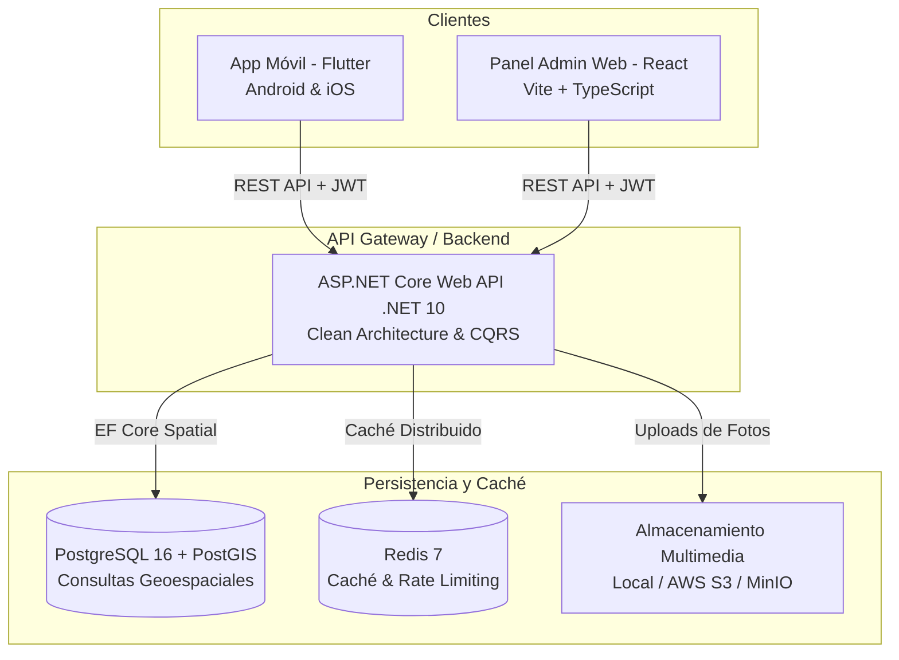

# RDReporta 🇩🇴 — Resumen Ejecutivo y Arquitectura Técnica del Proyecto

> **Fecha:** 28 de Septiembre de 2026  
> **Estado:** Fase Activa de Desarrollo (Backend + Admin Web + App Móvil + Suite de Auditoría)  
> **Aprobación de Calidad:** 100% (5/5 pruebas de auditoría superadas)

---

## 1. Visión y Propósito del Proyecto

**RDReporta** es una plataforma ciudadana multiplataforma diseñada para la República Dominicana que permite reportar, verificar y consultar incidentes comunitarios, viales, de infraestructura y de seguridad en tiempo real.

### Principios Fundamentales de Diseño e Interacción
1. **Veracidad Basada en Confirmación Ciudadana:** En lugar de algoritmos opacos, una incidencia gana peso cuando otros ciudadanos en la misma zona geográfica pulsan *"Confirmo"* ("Yo estuve ahí / Sigue ocurriendo").
2. **Sin Mensajes Directos ni Comentarios Libres:** Para erradicar el ciberacoso, la difamación y el ruido, la plataforma no cuenta con mensajería privada ni hilos de discusión abierta. La comunicación es exclusivamente fáctica y estructurada.
3. **Privacidad por Diseño:** Las coordenadas GPS del usuario nunca se transmiten en tiempo real ni se rastrean; únicamente se asocian al reporte cuando el usuario decide publicarlo.

---

## 2. Arquitectura Global del Sistema

---

## 3. Detalle de Módulos y Tecnologías Implementadas

### A. Backend (`backend/`) — .NET 10 Web API
* **Arquitectura:** Clean Architecture estructurada en 4 capas desacopladas:
  - **`RdReporta.Domain`:** Entidades (`User`, `Post`, `Category`, `PostConfirmation`, `PostReaction`, `ModerationReport`, `AuditLog`), enums (`PostStatus`, `UserRole`, `ReactionType`), y reglas de dominio.
  - **`RdReporta.Application`:** Servicios, DTOs, validaciones con FluentValidation, abstracciones de repositorios y lógica de geolocalización.
  - **`RdReporta.Infrastructure`:** Implementación con Entity Framework Core, soporte geoespacial con `NetTopologySuite`, JWT con Refresh Tokens, almacenamiento de imágenes y Redis.
  - **`RdReporta.Api`:** Controladores RESTful con Swagger/OpenAPI, middlewares globales de excepción, compresión, rate limiting y CORS configurados.
* **Controladores Clave:**
  - `AuthController`: Registro, inicio de sesión seguro (BCrypt), renovación mediante Refresh Tokens.
  - `UsersController`: Perfil de usuario autenticado (`/me`), edición de datos personales, estadísticas de reputación.
  - `PostsController`: Publicación de incidentes con georreferenciación, consultas por radio (`nearby`), publicaciones populares semanales (`popular`), cuadrante de mapa (`map`), confirmaciones ciudadanas y reacciones.
  - `CategoriesController`: Gestión de categorías urbanas habilitadas.
  - `ModerationController`: Recepción y resolución de denuncias comunitarias sobre contenido indebido.

---

## 4. Base de Datos y Datos Semilla (`database/` & `docker/`)
* **Motor:** PostgreSQL 16 con la extensión geoespacial **PostGIS**.
* **Índices Espaciales:** Índices GIST sobre coordenadas `Point` (SRID 4326) para búsquedas de alta velocidad por distancia y polígonos.
* **Semillas (Seeds):**
  - Catálogo de categorías oficiales de República Dominicana: Baches y Vías, Alumbrado Público, Semáforos Averiados, Inundaciones Urbanas, Accidentes de Tránsito, Fuga de Agua Potable, Recogida de Desechos, etc.
  - Provincias y municipios dominicanos con sus coordenadas centrales y polígonos delimitadores.
* **Infraestructura Contenedorizada:** `docker-compose.yml` preconfigurado con PostgreSQL + PostGIS, Redis y PgAdmin.

---

## 5. Panel Administrativo Web (`admin/`) — React + Vite + TypeScript
* **Stack:** React 19, TypeScript, Tailwind CSS, Lucide Icons, Vite.
* **Funcionalidades:**
  - **Dashboard Métrico:** Visualización de métricas clave (total de incidencias, incidencias pendientes, resueltas, total de confirmaciones ciudadanas).
  - **Bandeja de Publicaciones:** Tabla de gestión con filtros por estatus, categoría y búsqueda por texto.
  - **Módulo de Moderación:** Cola de revisión de reportes marcados por usuarios para su aprobación o retiro.
  - **Gestor de Categorías:** Configuración de categorías de servicio público con iconos y colores distintivos.
  - **Conexión API Tipada:** Cliente modular con Axios e interceptores para autenticación con token Bearer.

---

## 6. Aplicación Móvil (`mobile/`) — Flutter (Android & iOS)

### 1. Sistema de Diseño e Identidad Visual (Estilo FinanzApp + Rosé Pine)
* **Paleta Rosé Pine:**
  - **Modo Oscuro (`Rosé Pine`):** Fondo base `#191724`, tarjetas en `#1F1D2E`, acentos en *Love* (`#EB6F92`), *Pine* (`#31748F`), *Gold* (`#F6C177`) e *Iris* (`#C4A7E7`).
  - **Modo Claro de Alto Contraste (`Rosé Pine Dawn`):** Fondo base marfil suave `#F4F1EA`, tarjetas y docks flotantes en **blanco puro (`#FFFFFF`) con bordes nítidos (`#DCD6CC`)** y sombras suaves. Tipografía en tinta carbón (`#1F1D2E` y `#433F5A`) cumpliendo el estándar **WCAG AAA** de contraste y legibilidad.
* **Persistencia de Tema:** Controlado mediante `AppTheme.themeNotifier` y almacenado de forma segura en `FlutterSecureStorage`.
* **Fondo Atmosférico Dinámico (`AtmosphericBackground`):**
  - Orbes luminosos desenfocados en degradado radial que cambian automáticamente entre tema claro (tonos pastel suaves) y tema oscuro (luces de neón cálidas).
  - Botón flotante superior derecho (`☀️ / 🌙`) para alternar tema antes de ingresar.

### 2. Navegación y Estructura de Pantallas
* **Barra de Navegación Flotante (Floating Dock):**
  - Dock tipo píldora suspendido con esquinas curvas y elevación visual idéntico al concepto minimalista de FinanzApp.
  - Botón central de acción flotante (FAB) para la creación instantánea de reportes.
  - 4 Secciones principales:
    1. **Inicio / Feed:**
       - Tarjetas superiores de resumen métrico ("Total", "En Proceso", "Resueltos").
       - Listado de incidencias con fotografías, etiquetas coloreadas de categoría, tiempo transcurrido relativo, distancia y botón de confirmación comunitaria.
       - Acceso rápido a cambio de tema en la barra superior.
    2. **Mapa Interactivo:** Marcadores geolocalizados de incidentes clasificados por categoría y ubicación del usuario.
    3. **Populares:** Ranking de incidentes con mayor impacto y confirmaciones durante la semana.
    4. **Perfil y Ajustes:**
       - Perfil de usuario con historial de aportes y reputación comunitaria.
       - Modo Invitado adaptativo (*Guest View*) con invitación al registro.
       - **Tarjeta interactiva de "Apariencia y Tema"** con selector de 3 estados: *Oscuro*, *Claro*, y *Auto (Sistema)*.
       - Modal de Normas Comunitarias y Compromiso de Privacidad.
* **Flujo de Autenticación Completo:**
  - Pantalla de Login, Registro de cuenta, Recuperación de contraseña y opción "Continuar como invitado".

---

## 7. Auditoría Continua y Aseguramiento de Calidad (QA)

Se implementó el script automatizado PowerShell `.\scripts\run_audit.ps1` que se ejecuta de forma periódica para garantizar la salud del código:

| Check | Componente | Herramienta | Estado Actual |
|---|---|---|---|
| **[1/5]** | Backend (.NET 10) | `dotnet build` | ✅ 0 Errores, 0 Advertencias |
| **[2/5]** | Seguridad Backend | `dotnet list package --vulnerable` | ✅ 0 Vulnerabilidades en NuGet |
| **[3/5]** | Tests Móvil (Flutter) | `flutter test` | ✅ 100% Tests pasados |
| **[4/5]** | Análisis Estático Móvil | `flutter analyze` | ✅ 0 Errores, 0 Advertencias |
| **[5/5]** | Frontend Web (Admin) | `npm run build` (Vite + TS) | ✅ Compilación correcta sin errores de tipos |

---

## 8. Próximos Pasos y Roadmap Recomendado

1. **Integración en Tiempo Real (Push & WebSockets):**
   - Configuración de Firebase Cloud Messaging (FCM) en el backend y la app móvil para alertas de incidentes cercanos.
2. **Servicio de Mapas en Vivo:**
   - Habilitar clave de API de Google Maps / MapLibre en Android e iOS para renderizar el visor satelital nativo.
3. **Flujo de Captura y Carga Real de Fotos:**
   - Conectar el servicio de subida de imágenes de la app móvil hacia el endpoint de almacenamiento del backend.
4. **Despliegue y Pruebas en Staging:**
   - Despliegue de los contenedores Docker en un servidor de prueba accesible para pruebas de campo en Santo Domingo/Santiago.
