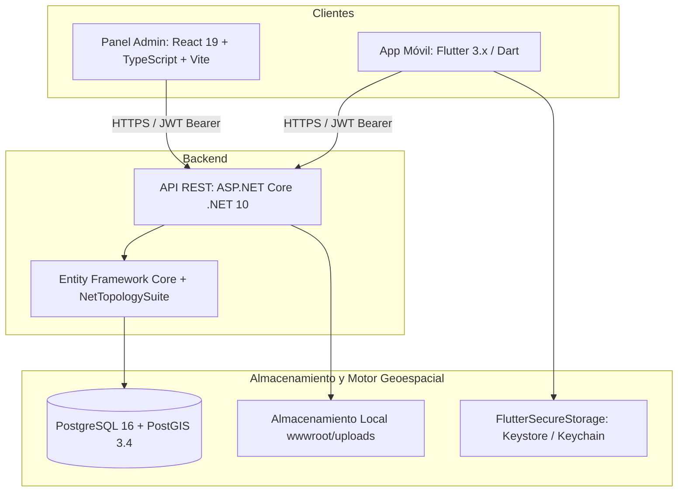

# Documento Maestro de Arquitectura, Tecnologías y Justificación Técnica

**Proyecto:** RDReporta  
**Fecha de actualización:** 28 de septiembre de 2026  
**Propósito:** Especificación integral de cada tecnología, librería, patrón de diseño y decisión de arquitectura implementada en la plataforma, con su respectiva justificación técnica del **por qué** fue seleccionada.

---

## 1. Visión General del Proyecto y Filosofía de Diseño

**RDReporta** es una plataforma ciudadana diseñada para el reporte, seguimiento y validación comunitaria de incidencias en la vía pública (baches, fallas de alumbrado, semáforos averiados, vertederos clandestinos, fugas de agua, etc.) en toda la República Dominicana.

### 1.1 Filosofía de "Cero Toxicidad" (Anti-Social Network)
A diferencia de las redes sociales convencionales, RDReporta implementa una arquitectura deliberadamente restrictiva:
* **Sin comentarios abiertos:** Se elimina la posibilidad de debates agresivos, insultos, difamaciones o desinformación.
* **Sin mensajería directa (DMs):** Protege la privacidad de los ciudadanos y evita el acoso o el spam.
* **Confirmación Comunitaria ("Confirmo"):** La validación de que un problema existe o sigue vigente se realiza mediante un contador de confirmaciones de vecinos presenciales.
* **Reacciones Tipadas ("Importante"):** Señalización cívica sin contadores de "me gusta" ni algoritmos de enganche basados en polarización.
* **Moderación Administrativa Centralizada:** Denuncias atendidas por moderadores mediante un panel web con trazabilidad.

---

## 2. Mapa Tecnológico Global

---

## 3. Frontend Móvil: Flutter y Dart

### 3.1 Tecnologías y Librerías Utilizadas

| Paquete / Tecnología | Versión | Rol en la Aplicación |
|---|---|---|
| **Flutter SDK** | `>=3.0.0 <4.0.0` | Framework multiplataforma de interfaz de usuario compilado a código nativo para Android e iOS. |
| **Dart** | 3.x | Lenguaje tipado con *Sound Null Safety*, compilación AOT y recolección de basura eficiente. |
| **dio** | `^5.7.0` | Cliente HTTP avanzado para comunicación con la API REST. |
| **flutter_secure_storage** | `^9.2.2` | Almacenamiento cifrado en reposo para credenciales y tokens JWT. |
| **flutter_bloc** | `^8.1.6` | Patrón de gestión de estado desacoplado, testeable y predecible. |
| **google_maps_flutter** | `^2.10.0` | Integración con mapas vectoriales nativos para visualización geográfica. |
| **geolocator** | `^13.0.1` | Acceso a sensores de GPS y gestión de permisos de ubicación en runtime. |
| **image_picker** | `^1.1.2` | Captura de fotografías con la cámara del dispositivo o selección desde galería. |
| **cached_network_image** | `^3.4.1` | Descarga, renderizado y almacenamiento en caché de imágenes en disco y memoria. |
| **intl** | `^0.19.0` | Localización, formateo de fechas y números en español dominicano. |
| **cupertino_icons** | `^1.0.8` | Iconografía nativa del ecosistema iOS para diseño adaptativo. |
| **flutter_lints** | `^5.0.0` | Conjunto de reglas oficiales de análisis estático recomendadas por el equipo de Flutter. |

---

### 3.2 Justificación Técnica: ¿Por qué se eligió cada componente en Móvil?

#### 1. Flutter en lugar de React Native, Kotlin Multiplatform o Desarrollo Nativo Puro
* **Por qué:** Permite mantener una única base de código para Android e iOS con renderizado propio a 60/120 FPS (motores Skia e Impeller), eliminando la sobrecarga del puente de serialización JS de React Native clásico. Asegura que la apariencia visual y las animaciones sean idénticas en ambas plataformas.

#### 2. `dio` en lugar del paquete básico `http` de Dart
* **Por qué:**
  * **Interceptores de Petición:** Permite adjuntar automáticamente el encabezado `Authorization: Bearer <token>` en todas las peticiones salientes sin repetir código.
  * **Manejo Concurrente de Renovación (Mutex):** En `ApiClient`, cuando múltiples llamadas simultáneas devuelven error 401, Dio permite interceptar el error, poner en cola las peticiones, renovar el token una sola vez y reintentar automáticamente las solicitudes pendientes con el nuevo token.
  * **Soporte Nativo Multipart/FormData:** Facilita la subida de fotografías de incidencias con streams de archivos sin saturar la memoria.
  * **Timeouts Configurables:** Soporta `connectTimeout` y `receiveTimeout` independientes para detectar caídas de red rápidamente.

#### 3. `flutter_secure_storage` en lugar de `shared_preferences`
* **Por qué:** `shared_preferences` almacena los datos en archivos de texto plano XML (Android) o listas plist (iOS), totalmente legibles si el dispositivo es rooteado, liberado o mediante copias de seguridad. `flutter_secure_storage` utiliza **Android Keystore con `EncryptedSharedPreferences` (AES-256-GCM)** y **iOS Keychain con Secure Enclave**, garantizando que los tokens de sesión no puedan ser extraídos por aplicaciones maliciosas.

#### 4. `cached_network_image` en lugar de `Image.network` estándar
* **Por qué:** `Image.network` descarga la imagen cada vez que el widget se reconstruye o sale de la vista, consumiendo el plan de datos del usuario y provocando parpadeos. `cached_network_image` almacena las imágenes en el almacenamiento temporal del dispositivo, reduce el consumo de red a cero tras la primera descarga, y permite limitar la resolución en memoria (`memCacheWidth`), evitando desbordamientos de memoria RAM al visualizar feeds con cientos de reportes con fotos.

#### 5. `geolocator` con degradación manual
* **Por qué:** Ofrece precisión de ubicación en tiempo real mediante satélites GPS y triangulación de antenas, gestionando el ciclo de vida de permisos en Android 14/15 e iOS 17+. En caso de que el usuario rechace el permiso, la app incluye un catálogo geográfico precargado de las 31 provincias y el Distrito Nacional para no bloquear la experiencia.

#### 6. Sistema de Diseño Rosé Pine y Rosé Pine Dawn
* **Por qué:** Cumple con las pautas de accesibilidad **WCAG 2.1 nivel AA** con ratios de contraste superiores a 4.5:1. Dispone de variantes clara y oscura coherentes que reducen la fatiga visual nocturna sin perder jerarquía ni legibilidad.

---

## 4. Backend: .NET 10 y Clean Architecture

### 4.1 Tecnologías y Librerías del Servidor

| Componente | Versión | Rol en el Servidor |
|---|---|---|
| **.NET 10 (C# 13)** | `net10.0` | Runtime y lenguaje base de alto rendimiento y bajo consumo de memoria. |
| **ASP.NET Core Web API** | 10.0 | Framework web para controladores REST, inyección de dependencias y middlewares. |
| **Npgsql.EntityFrameworkCore.PostgreSQL** | `10.0.0-preview.5` | Proveedor oficial de Entity Framework Core para bases de datos PostgreSQL. |
| **NetTopologySuite** | `10.0.0-preview.5` | Librería de tipos espaciales para manipulación de geometrías y cálculos geodésicos en PostGIS. |
| **Microsoft.AspNetCore.Authentication.JwtBearer** | `10.0.0` | Middleware para validación y descifrado de tokens de autenticación JWT. |
| **BCrypt.Net-Next** | `4.2.0` | Algoritmo de hashing adaptativo con sal para contraseñas de usuarios. |
| **Microsoft.AspNetCore.RateLimiting** | Integrado en .NET | Middleware de protección contra abusos, ataques de fuerza bruta y saturación de endpoints. |
| **Microsoft.AspNetCore.DataProtection** | Integrado en .NET | Cifrado y validación criptográfica de tokens temporales de recuperación de contraseñas. |
| **Scalar.AspNetCore** | `2.17.10` | Interfaz interactiva de documentación OpenAPI moderna (alternativa a Swagger). |

---

### 4.2 Justificación Técnica: ¿Por qué se eligió esta arquitectura en Backend?

#### 1. .NET 10 y C# en lugar de Node.js, Python o Go
* **Por qué:**
  * **Rendimiento:** .NET es uno de los runtimes más veloces del mercado, superando ampliamente a Node.js y Python en operaciones de cálculo numérico, parseo JSON y rendimiento por vCPU.
  * **Seguridad de Tipos y Escalabilidad:** El compilador de C# previene errores de tipado en tiempo de compilación. Su modelo de concurrencia basado en tareas asíncronas (`async/await`) permite manejar miles de peticiones simultáneas con consumo mínimo de hilos de sistema operativo.

#### 2. Clean Architecture (Separación en 4 Proyectos)
La solución se encuentra estructurada siguiendo los principios de la Arquitectura Limpia:
1. **`RdReporta.Domain`:** Entidades (`User`, `Post`, `Category`, `PostConfirmation`), enumeraciones y reglas de negocio puras. No tiene referencias a ningún paquete externo ni base de datos.
2. **`RdReporta.Application`:** Interfaces de servicios, DTOs de entrada y salida, contratos de repositorio y lógica de orquestación.
3. **`RdReporta.Infrastructure`:** Implementación de persistencia con Entity Framework Core, acceso a PostGIS, generación de hashes BCrypt, servicio de almacenamiento de archivos y configuración de base de datos.
4. **`RdReporta.Api`:** Controladores REST, middlewares de excepción, rate limiting, configuración de autenticación JWT y documentación Scalar.
* **Justificación:** Si en el futuro se decide cambiar PostgreSQL por otra base de datos o reemplazar el almacenamiento local por Amazon S3 / Azure Blob Storage, solo se modifica la capa de infraestructura sin alterar el dominio ni la lógica de aplicación.

#### 3. PostGIS y NetTopologySuite en lugar de latitud/longitud decimal simple
* **Por qué:** Guardar `latitude` y `longitude` como números de punto flotante impide realizar consultas geoespaciales eficientes. Al usar el tipo nativo `Point` de NetTopologySuite indexado con **GiST (Generalized Search Tree)** en PostgreSQL:
  * El cálculo de incidencias "Cerca de mí" se resuelve en milisegundos mediante la función nativa `ST_DWithin` sobre el elipsoide de la Tierra (WGS84 / SRID 4326).
  * El filtrado por cuadrante del mapa (`minLat/maxLat`, `minLng/maxLng`) utiliza el operador espacial `&&` optimizado por hardware.

#### 4. BCrypt.Net-Next en lugar de SHA-256 o MD5
* **Por qué:** SHA-256 es un algoritmo criptográfico ultrarrápido diseñado para verificación de integridad de datos; un atacante con tarjetas gráficas (GPUs) puede probar miles de millones de hashes por segundo. BCrypt es una función deliberadamente lenta (*key stretching*) con factor de coste configurable y sal aleatoria obligatoria, neutralizando ataques de fuerza bruta y tablas arcoíris (*rainbow tables*).

#### 5. Rate Limiting nativo en endpoints sensibles
* **Por qué:** El endpoint `/api/auth/login` y `/api/auth/register` tiene configurada una política fija de **15 solicitudes por minuto por IP** (`PermitLimit = 15, Window = 1m`). Si un bot intenta adivinar contraseñas, el servidor responde inmediatamente con código HTTP 429 (`Too Many Requests`), protegiendo el CPU y la base de datos sin necesidad de dependencias externas.

#### 6. Scalar en lugar de Swagger UI tradicional
* **Por qué:** Swagger UI ha quedado desactualizado en diseño y velocidad. Scalar ofrece una experiencia moderna, modo oscuro por defecto, navegación fluida, generación interactiva de llamadas en múltiples lenguajes (cURL, C#, Dart, TypeScript) y cumplimiento nativo de la especificación OpenAPI 3.1 de .NET 10.

---

## 5. Base de Datos: PostgreSQL 16 + PostGIS 3.4

### 5.1 Justificación Técnica
* **Motor Abierto y Estándar de la Industria:** PostgreSQL es el motor relacional de código abierto más robusto y conforme al estándar ANSI SQL.
* **Extensión Espacial PostGIS:** Es el estándar de facto a nivel mundial para Sistemas de Información Geográfica (GIS). Permite indexación R-Tree, proyecciones geográficas, análisis de proximidad y clusters geoespaciales directamente en la base de datos.
* **Semillas Geográficas Dominicanas:** La base de datos incluye un inicializador (`DbInitializer.cs`) con las 31 provincias y el Distrito Nacional, junto con categorías preconfiguradas con colores y nombres estandarizados.
* **Contenerización con Docker Compose:** Se proporciona un archivo `docker-compose.yml` que levanta la base de datos con volúmenes persistentes (`rdreporta_pgdata`) y comprobaciones de salud automáticas (`pg_isready`).

---

## 6. Panel Administrativo Web: React 19, TypeScript y Vite

### 6.1 Tecnologías Utilizadas

| Herramienta | Versión | Rol en el Panel |
|---|---|---|
| **React** | `19.2.8` | Librería para interfaces web reactivas y declarativas. |
| **TypeScript** | `~6.0.2` | Superset de JavaScript con tipado estático estricto. |
| **Vite** | `^8.3.0` | Empaquetador y entorno de desarrollo frontend basado en Rollup y ES Modules. |
| **lucide-react** | `^1.48.0` | Set de íconos vectoriales SVG optimizados para tree-shaking. |
| **oxlint** | `^1.81.0` | Linter ultra-rápido desarrollado en Rust para verificación de código. |

---

### 6.2 Justificación Técnica: ¿Por qué se eligió este stack en el Panel?

#### 1. React 19 y TypeScript en lugar de HTML/JS tradicional o Blazor
* **Por qué:** El panel requiere una interfaz ágil, reactiva y modular para que moderadores y administradores gestionen cientos de incidencias, filtren por categorías, cambien estados y visualicen fotos sin recargar la página. TypeScript garantiza que los modelos de datos del panel coincidan exactamente con los contratos JSON del backend, evitando errores de propiedades indefinidas en tiempo de ejecución.

#### 2. Vite 8 en lugar de Create React App o Webpack
* **Por qué:** Create React App está deprecado por el equipo oficial de React. Webpack presenta tiempos de compilación lentos en proyectos con muchos módulos. Vite compila la aplicación en modo producción en apenas **1.2 segundos** y ofrece Hot Module Replacement (HMR) casi instantáneo durante el desarrollo.

#### 3. Oxlint en lugar de ESLint tradicional
* **Por qué:** Desarrollado en Rust, Oxlint es entre 50 y 100 veces más rápido que ESLint. Permite verificar reglas de calidad, variables sin usar y posibles bugs de renderizado en milisegundos tanto en local como en pipelines de CI/CD.

---

## 7. Automatización, Pruebas y Scripts

### 7.1 Script de Auditoría Automatizada (`scripts/run_audit.ps1`)
Script en PowerShell que orquesta la verificación completa del sistema en una sola ejecución:
1. **Compilación Backend (.NET 10):** Valida que no existan errores de sintaxis o referencias rotas.
2. **Escaneo de Vulnerabilidades NuGet:** Ejecuta `dotnet list package --vulnerable` e inspecciona el resultado JSON para detectar paquetes con fallos de seguridad conocidos.
3. **Pruebas Automatizadas en Móvil (Flutter Test):** Corre 21 pruebas unitarias y de widgets (flujos de autenticación, renovación de tokens, prevención de overflows visuales y permisos).
4. **Análisis Estático en Móvil (Flutter Analyze):** Valida que no haya violaciones a las directrices de código de Dart ni advertencias de tipo.
5. **Compilación y Chequeo de Tipos en Admin (React + TypeScript):** Ejecuta `tsc -b && vite build` para garantizar que la web compile sin errores de tipado y genere el bundle listo para producción.

### 7.2 Navegación Automatizada E2E (`scripts/check_admin.cjs`)
Script en Node.js que simula la interacción de un usuario real sobre el panel administrativo en Chrome/Edge:
* Verifica el formulario de inicio de sesión de administradores.
* Comprueba la navegación, búsqueda y filtrado de incidencias.
* Verifica el diálogo modal de moderación y la resolución de denuncias con notas.
* Toma capturas de pantalla automáticas (`artifacts/admin-check/`) como evidencia de calidad visual.

---

## 8. Matriz Comparativa: Resumen de Decisiones de Arquitectura

| Área | Tecnología Seleccionada | Alternativa Descartada | Razón Técnica Decisiva |
|---|---|---|---|
| **Framework Móvil** | Flutter / Dart | React Native / Nativo Puro | Un solo codebase, renderizado propio a 60/120 FPS sin puente JS, comportamiento idéntico en iOS y Android. |
| **Cliente HTTP Móvil** | Dio | `http` estándar de Dart | Interceptores automáticos de autenticación, renovación concurrente de tokens (Mutex) y subida de archivos multipart. |
| **Almacenamiento Seguro** | `flutter_secure_storage` | `shared_preferences` | Cifrado por hardware con AES-256-GCM / Secure Enclave frente a archivos de texto plano desprotegidos. |
| **Backend API** | .NET 10 (C#) | Node.js / Python | Rendimiento extremo, tipado estático en compilación, bajo consumo de recursos y soporte AOT. |
| **Base de Datos** | PostgreSQL 16 + PostGIS | MySQL / MongoDB | Consultas geoespaciales nativas con indexación GiST (`ST_DWithin`) esenciales para radio de incidencias. |
| **Hashing de Claves** | BCrypt.Net-Next | SHA-256 / MD5 | Función deliberadamente lenta resistente a ataques de fuerza bruta y ataques por GPU con sal automática. |
| **Bundler Web Admin** | Vite 8 | Webpack / CRA | Compilación de producción en 1.2 segundos, arranque instantáneo y CRA oficialmente obsoleto. |
| **Linter Web** | Oxlint (Rust) | ESLint | Análisis estático hasta 100 veces más veloz sin sobrecarga en pipelines de integración continua. |
| **Docs API** | Scalar | Swagger UI | Interfaz moderna, tema visual oscuro integrado, navegación ligera y soporte nativo OpenAPI 3.1. |

---

## 9. Estado Actual del Código y Verificación

El proyecto cuenta con el **100% de las verificaciones aprobadas**:
* **Backend:** Compila sin errores.
* **Seguridad de dependencias:** 0 vulnerabilidades detectadas.
* **Móvil:** 21 pruebas unitarias y de widgets aprobadas, 0 advertencias de análisis estático.
* **Web Admin:** Compilación tipada y empaquetada lista para despliegue.
