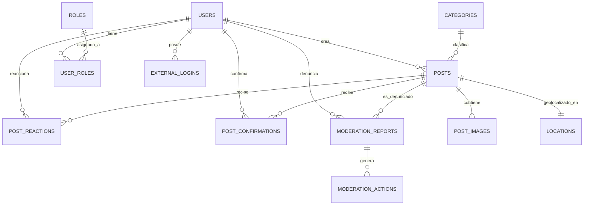

# RDReporta - Modelo de Datos Relacional y Espacial

## 1. Diagrama Entidad-Relación (Visión Conceptual)



---

## 2. Definición Detallada de Tablas

### 2.1 Usuarios y Seguridad

#### `users`
| Campo | Tipo | Restricción | Descripción |
|---|---|---|---|
| `id` | UUID | PK, DEFAULT gen_random_uuid() | Identificador único |
| `username` | VARCHAR(50) | NOT NULL, UNIQUE | Nombre de usuario público |
| `email` | VARCHAR(256) | NOT NULL, UNIQUE | Correo electrónico principal |
| `password_hash` | VARCHAR(500) | NULL | Hash de la contraseña (nulo si es OAuth puro) |
| `avatar_url` | VARCHAR(1000) | NULL | URL del avatar del usuario |
| `province` | VARCHAR(100) | NULL | Provincia de residencia principal (RD) |
| `municipality` | VARCHAR(100) | NULL | Municipio de residencia |
| `reputation_score` | INTEGER | NOT NULL, DEFAULT 100 | Puntuación numérica interna |
| `reputation_level` | VARCHAR(30) | NOT NULL, DEFAULT 'Ciudadano' | 'Ciudadano', 'Colaborador', 'ColaboradorConfiable' |
| `is_verified` | BOOLEAN | NOT NULL, DEFAULT FALSE | Correo validado |
| `is_active` | BOOLEAN | NOT NULL, DEFAULT TRUE | Estado de la cuenta |
| `created_at` | TIMESTAMPTZ | NOT NULL, DEFAULT NOW() | Fecha de registro |
| `updated_at` | TIMESTAMPTZ | NOT NULL, DEFAULT NOW() | Última modificación |

#### `roles` & `user_roles`
- Soporte para roles: `Ciudadano`, `Moderador`, `Administrador`, `Institución`.

#### `external_logins`
- `user_id` (FK), `provider` ('Google', 'Apple'), `provider_key`, `created_at`.

---

### 2.2 Publicaciones y Georreferenciación

#### `categories`
| Campo | Tipo | Restricción | Descripción |
|---|---|---|---|
| `id` | INT | PK, IDENTITY | Identificador de categoría |
| `name` | VARCHAR(50) | NOT NULL, UNIQUE | Ej: 'Accidentes', 'Tránsito', 'Inundaciones' |
| `slug` | VARCHAR(60) | NOT NULL, UNIQUE | Identificador URL-friendly |
| `description` | VARCHAR(255) | NULL | Descripción de la categoría |
| `icon_name` | VARCHAR(50) | NOT NULL | Nombre de ícono para la app móvil |
| `color_hex` | VARCHAR(10) | NOT NULL | Color temático en hexadecimal (#E53935) |
| `display_order` | INT | NOT NULL, DEFAULT 0 | Orden para visualización |
| `is_active` | BOOLEAN | NOT NULL, DEFAULT TRUE | Activa o inactiva |

#### `posts`
| Campo | Tipo | Restricción | Descripción |
|---|---|---|---|
| `id` | UUID | PK, DEFAULT gen_random_uuid() | Identificador único del reporte |
| `user_id` | UUID | FK -> users.id, NOT NULL | Autor del reporte |
| `category_id` | INT | FK -> categories.id, NOT NULL | Categoría de la incidencia |
| `title` | VARCHAR(150) | NOT NULL | Título o resumen breve |
| `description` | TEXT | NOT NULL | Detalle de la situación |
| `location_coordinates` | GEOGRAPHY(Point, 4326) | NOT NULL | Coordenadas WGS84 (Lat, Lng) |
| `province` | VARCHAR(100) | NOT NULL | Provincia de República Dominicana |
| `municipality` | VARCHAR(100) | NOT NULL | Municipio / Distrito Municipal |
| `address_reference` | VARCHAR(255) | NULL | Calle, esquina o punto de referencia |
| `status` | VARCHAR(30) | NOT NULL, DEFAULT 'Active' | 'Active', 'Resolved', 'Hidden', 'Archived' |
| `views_count` | INT | NOT NULL, DEFAULT 0 | Contador de visualizaciones |
| `reactions_count` | INT | NOT NULL, DEFAULT 0 | Caché de total de reacciones |
| `confirmations_count` | INT | NOT NULL, DEFAULT 0 | Total de confirmaciones ciudadanas |
| `created_at` | TIMESTAMPTZ | NOT NULL, DEFAULT NOW() | Fecha de publicación |
| `updated_at` | TIMESTAMPTZ | NOT NULL, DEFAULT NOW() | Última modificación |

*Índice espacial fundamental:*
```sql
CREATE INDEX idx_posts_coordinates ON posts USING GIST (location_coordinates);
CREATE INDEX idx_posts_created_at ON posts (created_at DESC);
CREATE INDEX idx_posts_province ON posts (province);
```

#### `post_images`
| Campo | Tipo | Restricción | Descripción |
|---|---|---|---|
| `id` | UUID | PK, DEFAULT gen_random_uuid() | Identificador de la imagen |
| `post_id` | UUID | FK -> posts.id, ON DELETE CASCADE | Reporte asociado |
| `image_url` | VARCHAR(1000) | NOT NULL | URL en almacenamiento S3 |
| `thumbnail_url` | VARCHAR(1000) | NULL | Versión optimizada de carga rápida |
| `order_index` | INT | NOT NULL, DEFAULT 0 | Orden de visualización en carrusel |
| `created_at` | TIMESTAMPTZ | NOT NULL, DEFAULT NOW() | Fecha de carga |

---

### 2.3 Interacción Ciudadana (Sin Comentarios ni Mensajes)

#### `post_reactions`
| Campo | Tipo | Restricción | Descripción |
|---|---|---|---|
| `id` | BIGINT | PK, IDENTITY | Identificador único |
| `post_id` | UUID | FK -> posts.id, ON DELETE CASCADE | Publicación reaccionada |
| `user_id` | UUID | FK -> users.id, ON DELETE CASCADE | Usuario que reacciona |
| `reaction_type` | VARCHAR(30) | NOT NULL | 'MeInteresa', 'Importante', 'Impactante', 'EstoyAqui' |
| `created_at` | TIMESTAMPTZ | NOT NULL, DEFAULT NOW() | Momento de la reacción |

*Restricción única:* `UNIQUE(post_id, user_id, reaction_type)`.

#### `post_confirmations`
| Campo | Tipo | Restricción | Descripción |
|---|---|---|---|
| `id` | BIGINT | PK, IDENTITY | Identificador único |
| `post_id` | UUID | FK -> posts.id, ON DELETE CASCADE | Publicación confirmada |
| `user_id` | UUID | FK -> users.id, ON DELETE CASCADE | Usuario que verifica el hecho |
| `user_coordinates` | GEOGRAPHY(Point, 4326) | NULL | Coordenadas opcionales del usuario al confirmar |
| `is_nearby` | BOOLEAN | NOT NULL, DEFAULT FALSE | Si confirmó estando a menos de 500m del evento |
| `created_at` | TIMESTAMPTZ | NOT NULL, DEFAULT NOW() | Fecha de confirmación |

*Restricción única:* `UNIQUE(post_id, user_id)`.

---

### 2.4 Moderación

#### `moderation_reports`
- `id` (UUID), `post_id` (UUID), `reporter_user_id` (UUID), `reason` (VARCHAR), `description` (TEXT), `status` ('Pending', 'Reviewed', 'Dismissed', 'ActionTaken'), `created_at`.
- Restricción única: `UNIQUE(post_id, reporter_user_id)` para prevenir reportes duplicados de la misma persona.
